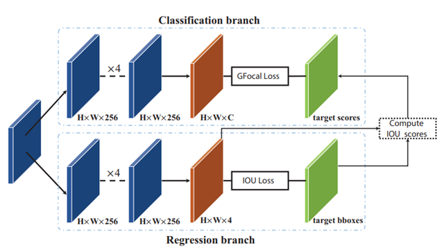

## DSLA: Dynamic Smooth Label Assignment for Efficient Anchor-free Object Detection
This is the official repo archiving the source code of **DSLA**.  

### **(The repo is under construction currently)**

### Introduction
Anchor-free detectors basically formulate object detection as dense classification and regression. 
For popular anchor-free detectors, it is common to introduce an individual prediction branch to 
estimate the quality of localization. The following inconsistencies are observed when we delve 
into the practices of classification and quality estimation. Firstly, for some adjacent samples 
which are assigned completely different labels, the trained model would produce similar 
classification scores. This violates the training objective and leads to performance degradation. 
Secondly, it is found that detected bounding boxes with higher confidences contrarily have smaller 
overlaps with the corresponding ground-truth. Accurately localized bounding boxes would be 
suppressed by less accurate ones in the Non-Maximum Suppression (NMS) procedure. To address 
the inconsistency problems, the Dynamic Smooth Label Assignment (DSLA) method is proposed. 
Based on the concept of centerness originally developed in FCOS, a smooth assignment strategy 
is proposed. The label is smoothed to a continuous value in [0, 1] to make a steady transition 
between positive and negative samples. Intersection-of-Union (IoU) is predicted dynamically 
during training and is coupled with the smoothed label. The dynamic smooth label is assigned 
to supervise the classification branch. Under such supervision, quality estimation branch is 
naturally merged into the classification branch, which simplifies the architecture of anchor-free 
detector. Comprehensive experiments are conducted on the MS COCO benchmark. It is demonstrated that,
DSLA can significantly boost the detection accuracy by alleviating the above inconsistencies for 
anchor-free detectors. Our paper is available [here]().


We adopt the similar network with FCOS except that the centerness branch is
omitted. In the head of our method, only two branches, classification branch 
and regression branch, are reserved. The inner structures are the same as ones 
in FCOS. H and W are height and width of feature maps, C is the number of 
classes. IoU scores are produced by computing the IoU between the predicted 
boxes and the gt boxes.

### How to
The implementation of DSLA is fully based on [mmdetection](https://github.com/open-mmlab/mmdetection).
So you need to learn how to play with mmdetection first. Here, we make a full copy of mmdetection source code
(version 2.20.0). You do not need to clone the source code of mmdetection individually, but to pay attention to
some important files:
* [dsla_head.py](mmdet/models/dense_heads/dsla_head.py) This is the core source file that implements all ideas of DSLA.
If you want to fully understand our method, this is the only file you need to read.
* [dsla_config](configs/dsla) This folder stores the typical configs of DSLA and some released model weights.
Refer to the [README.md](configs/dsla/README.md) for details.

For more instructions, please check the original [README](mmdet_README.md) from mmdetection.

### Citation
If you benefit from our work in your research, please kindly cite the paper
```
@article{DSLA,
  title={DSLA: Dynamic smooth label assignment for efficient anchor-free object detection},
  author={Su, Hu and He, Yonghao and Jiang, Rui and Zhang, Jiabin and Zou, Wei and Fan, Bin},
  journal={Pattern Recognition},
  vol={131},
  pages={108868},
  year={2022}
}
```
